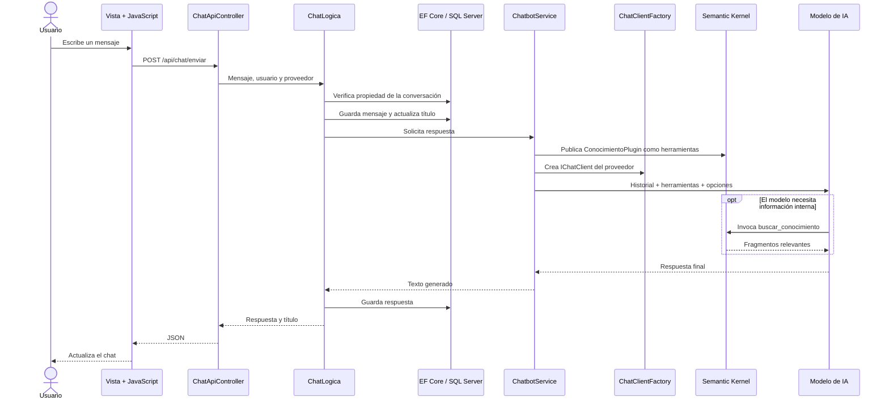

# Arquitectura del proyecto

## Propósito

La aplicación demuestra cómo construir un chatbot NLP mantenible sobre .NET 10. Combina una interfaz MVC, una API REST, persistencia de conversaciones, selección de proveedores de modelos y herramientas de recuperación de conocimiento.

## Proyectos de la solución

| Proyecto | Responsabilidad |
|---|---|
| `Tp-Investigacion-NLP-Web` | Interfaz MVC, endpoint REST, sesiones, middleware y composición de dependencias. |
| `Tp-Investigacion-NLP-Logica` | Casos de uso, abstracción de proveedores, orquestación del chatbot y plugin de conocimiento. |
| `Tp-Investigacion-NLP-Entidades` | Entidades, `DbContext`, configuración relacional y migraciones. |
| `Tp-Investigacion-NLP-Tests` | Pruebas automatizadas del conocimiento recuperado y comportamiento de soporte. |

## Flujo de una consulta

## Componentes principales

### Capa Web

- `Program.cs`: registra servicios, configura EF Core, sesiones y el pipeline HTTP.
- `ChatController`: sirve la pantalla, crea y elimina conversaciones.
- `ChatApiController`: valida y procesa el envío asíncrono de mensajes.
- `UsuarioController`: registro, inicio y cierre de sesión.
- `AuthMiddleware`: restringe rutas privadas según la sesión.
- `ApiExceptionMiddleware`: registra excepciones y devuelve errores JSON seguros para la API.
- `RecibirMensaje.js`: envía mensajes con `fetch` y actualiza la interfaz sin recargar.

### Capa lógica

- `ChatLogica`: coordina autorización, persistencia, título y generación.
- `ChatbotService`: arma el historial, limita contexto, añade herramientas y llama al modelo.
- `ChatClientFactory`: crea un `IChatClient` para Ollama, GitHub Models u OpenAI.
- `ConocimientoPlugin`: función nativa de Semantic Kernel que recupera fragmentos internos.
- `ConversacionLogica`, `MensajeLogica` y `UsuarioLogica`: operaciones de dominio y persistencia.

### Persistencia

- `Usuario`: identidad local y hash de contraseña.
- `Conversacion`: pertenece a un usuario y agrupa mensajes.
- `Mensaje`: contiene rol, texto, fecha y conversación.
- `NLPDbContext`: acceso a SQL Server mediante Entity Framework Core.

## Abstracciones y extensibilidad

La lógica conversacional depende de `IChatClient`, no del SDK concreto de un proveedor. Para añadir otro proveedor se debe:

1. Agregar un valor a `LLMProvider`.
2. Crear el cliente compatible con `IChatClient` en `ChatClientFactory`.
3. Agregar la opción a la vista.
4. Incorporar pruebas para configuración inválida y respuesta esperada.

Para añadir otra herramienta se crea una clase con métodos `[KernelFunction]`, se registra en DI y se convierte a `AIFunction` dentro de `ChatbotService`.

## Estado de la migración

La integración HTTP anterior fue retirada. Todo el flujo activo de proveedores utiliza `IChatClient` mediante `ChatClientFactory`.
